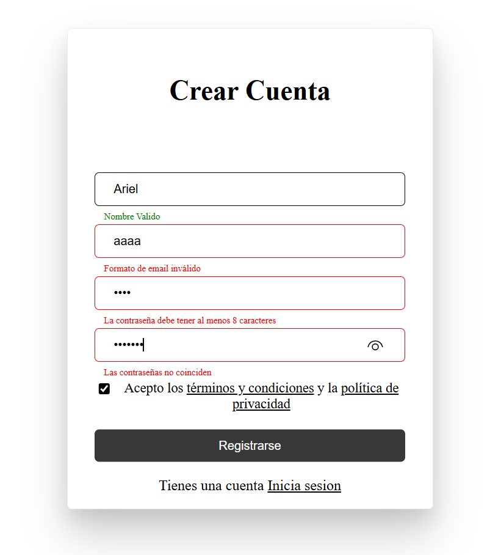
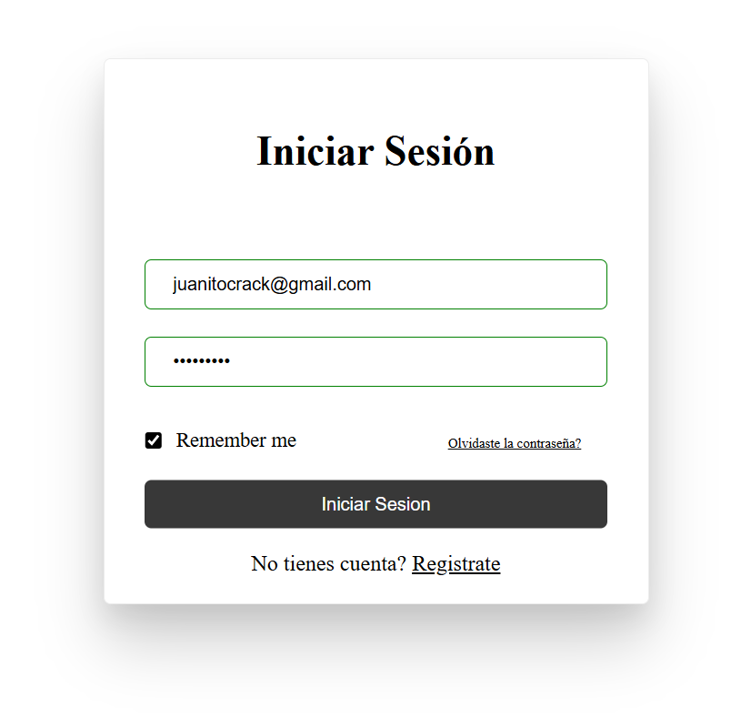

React Auth Components - Login & Register
https://img.shields.io/badge/React-18.2.0-61DAFB?style=flat&logo=react
https://img.shields.io/badge/Vite-4.0.0-646CFF?style=flat&logo=vite
https://img.shields.io/badge/React_Hook_Form-7.45.0-EC5990?style=flat&logo=reacthookform

Description:

Modern and responsive authentication components built with React + Vite. Includes Login and Register forms with advanced validation using react-hook-form.

Features
-Login with basic field validation

-Register with advanced validations:

Full name (letters and spaces only)

Email with strict format validation

Secure password (uppercase, lowercase, number)

Password confirmation

Terms and conditions acceptance

✅ Show/Hide password toggle

✅ Real-time password requirements

✅ Visual feedback with states (error, valid)

✅ Responsive design for all devices

✅ Smooth animations

✅ Server error handling

